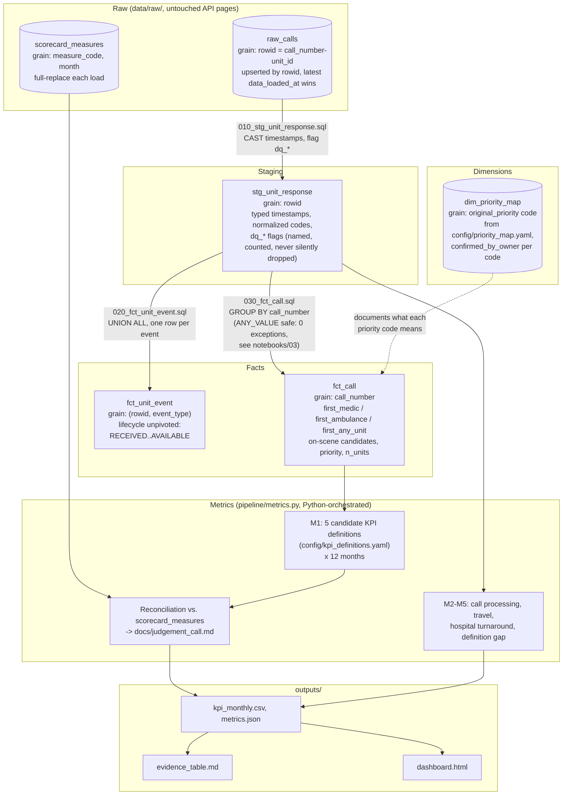

# Data Model

> The relational/event model behind `pipeline/transform/*.sql`, separate from `docs/source_map.md`'s
> source-to-fact diagram. Entities, events/states, and interactions/interventions/outcomes are
> described in `notebooks/03_workflow_model.ipynb`; this is the table-lineage view of the same
> model, as it's actually implemented in DuckDB. What each metric means (formula, clock fields,
> filters, exclusions, owner, confirmation status) is in `docs/kpi_definitions.md`.

## Table lineage

## Why `fct_call` carries three "on-scene" candidates instead of one

`fct_call` does not pick a single "first ambulance on scene" column. It carries
`first_medic_on_scene_dttm`, `first_ambulance_on_scene_dttm` (MEDIC+PRIVATE), and
`first_any_unit_on_scene_dttm` (any responder) side by side, because which one the official KPI
actually means is an open, empirically-tested question (`docs/assumptions.md` §4,
`docs/judgement_call.md`) - encoding a single choice into the model would have silently picked
an answer the data doesn't yet fully support.

## Why `dq_*` flags live on `stg_unit_response`, not a filter

Rows with an internally inconsistent timestamp (e.g. `on_scene_dttm` earlier than the unit's own
`response_dttm`) are flagged, not deleted, at the staging layer - `fct_call`'s on-scene
aggregations exclude only rows flagged `dq_response_after_onscene` (counted via
`excluded_dq_rows`), and any other query against `stg_unit_response` still sees every row. This
keeps the exclusion local to the specific calculation it protects, per CLAUDE.md rule 5 (never
silently drop rows from the dataset).
