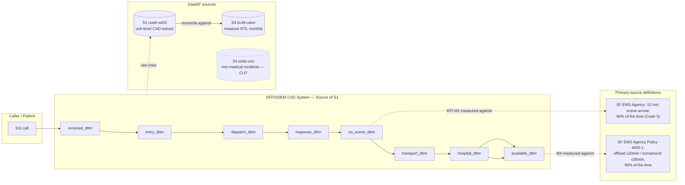

# Source Map

> Phase 1 (Class 4) deliverable. Business question → required facts → source → owner → grain →
> freshness → gaps. All facts below were pulled live from DataSF and SF.gov on 2026-09-23 and are
> cited with the query or URL used — nothing here is copied from `PROJECT_BRIEF.md` without
> re-verification. Where the brief's own numbers matched what we found, that's noted as
> "confirmed," not assumed.

## 1. Business questions → required facts → sources

| # | Business question | Facts required | Source | Owner | Grain | Freshness |
|---|---|---|---|---|---|---|
| Q1 | Where does response time get lost in the call lifecycle? | Per-unit lifecycle timestamps (received → entered → dispatched → en route → on scene → transport → hospital → available) | **S1** `nuek-vuh3` | SFFD / DEM (CAD system) | 1 row per unit per call | Near-real-time; sample pull returned rows from minutes before the query |
| Q2 | Can the published 88.4% (June 2026) be reproduced? | Official monthly KPI value + definition | **S3** `kc49-udxn`, measure `973` | Controller's Office, City Performance | 1 row per measure per month | Monthly; ~3-month lag (latest actual = June 2026 as of Sept 2026) |
| Q3 | What does the official measure actually count? | Written definition: clock start/end, included calls, included providers | SF EMS Agency policy + Controller's Office Annual Performance Report (APR) | SF EMS Agency / Controller's Office | policy document | Static, versioned by effective date |
| Q4 | How much ambulance capacity is lost at hospitals? | Hospital arrival → return-to-service interval; the *policy* standard for that interval | **S1** (`hospital_dttm`, `available_dttm`) + SF EMS Agency Policy 4000.1 | SFFD/DEM (data); SF EMS Agency (policy) | unit_response / policy document | Near-real-time (data); static (policy) |
| Q5 | Does the incident-level dataset add anything? | Incident narrative, outcome, cross-check | **S4** `wr8u-xric` | SFFD | 1 row per incident | ~3-4 week lag |
| Q6 | Does weather correlate with response time? | Hourly weather | Open-Meteo (opt.) | Open-Meteo | hourly | daily |

## 2. Source detail

### S1 — Fire Dept & EMS Dispatched Calls for Service (`nuek-vuh3`)
- **Owner:** San Francisco Fire Department / Division of Emergency Communications (DEM), published via DataSF OpenData.
- **Access:** SODA API, `https://data.sf.gov/resource/nuek-vuh3.json` (paginated `$limit`/`$offset`); bulk CSV export for backfill.
- **Grain:** 1 row per unit dispatched to a call. `rowid` = `call_number-unit_id`. Confirmed via a live sample pull (2026-09-23): call `262660269` has two rows, one per responding unit (`AM122` PRIVATE, `M503` MEDIC).
- **Size / freshness:** 7,442,946 total rows as of 2025-01-20 metadata snapshot; documented as "daily via automated data pipeline." A live query on 2026-09-23 returned rows with `received_dttm` ~6 minutes before the query ran — freshness is effectively near-real-time, better than the "daily" label suggests.
- **Columns confirmed (37 total)** include the full lifecycle: `received_dttm, entry_dttm, dispatch_dttm, response_dttm, on_scene_dttm, transport_dttm, hospital_dttm, available_dttm`, plus `original_priority`, `priority`, `final_priority`, `call_type_group`, `unit_type`, `als_unit`, `call_final_disposition`, `data_as_of`, `data_loaded_at`.
- **Gaps (confirmed by inspection, not assumed):**
  - No hospital identifier field — hand-over time cannot be attributed to a specific hospital.
  - No patient-contact timestamp — `on_scene_dttm` means the unit reached the address, not the patient's side.
  - `unit_type = PRIVATE` anonymizes which private ambulance contractor responded.
  - `original_priority` mixes two coding schemes in the same field: a live sample shows both numeric (`"2"`) and letter (`"A"`) values for `original_priority`, with `priority`/`final_priority` normalized to numeric only. Confirms brief Q2/Q3.

### S3 — City Performance Scorecard Measures (`kc49-udxn`), measure `973`
- **Owner:** Office of the Controller, City Performance Division (Proposition C, Nov 2003, mandates this reporting).
- **Access:** SODA API. Queried directly: `https://data.sf.gov/resource/kc49-udxn.json?measure_code=973`.
- **Confirmed live** (2026-09-23 query): `measure_title` = "Percentage of ambulances that arrive on-scene within 10 minutes to life-threatening medical emergencies"; `target` = 0.9; `actual` for 2026-06-30 = **0.884** (88.4%) — matches the brief exactly. 2026-04-30 = 0.885, 2026-05-31 = 0.868. No actual reported for July 2026 onward as of this pull, confirming the ~3-month reporting lag.
- **Fire Department has exactly one scorecard measure** (`973`) — confirmed by grouping the dataset on `department = 'Fire Department'`. There is **no official scorecard measure for call-processing time or hospital hand-over time** — M2 and M4 in this project have no official number to reconcile against; they are pipeline-derived only. This is worth stating explicitly so the decision memo doesn't imply an official baseline exists where one doesn't.
- **`measure_methodology` field:** returned empty/not populated for measure 973 in our query — confirms the brief's claim that the scorecard publishes no methodology field. The actual definition had to come from a secondary primary source (below).

### The measure's real definition — found in the Controller's Office FY25 Annual Performance Report
- **Source:** `Annual Performance Results, Fiscal Year 2024-2025`, Office of the Controller, City Performance Division, December 2025 (`media.api.sf.gov/documents/FY25_APR_Final.pdf`), p.17.
- **Quote:** *"During life-threatening Code 3 incidents (red lights and siren), first responders arrive at the scene and provide basic and/or advanced life support (BLS/ALS) to individual(s) in need of medical care. The City's goal is to respond quickly enough that ambulances arrive at the scene of Code 3 emergencies within ten minutes at least 90% of the time."*
- The scorecard table on p.14 labels the measure **"percentage of SFFD calls responded to within 10 minutes"** — the word "SFFD" suggests the metric is scoped to SFFD-run response, not private ambulance contractors. This is consistent with the brief's finding that `original ∈ {3,E}` + `MEDIC only` reproduces the official number most closely (brief's prototype: 87.4% vs 88.4%; the pipeline's own figure for June 2026 is 85.6% vs 88.4%, `docs/judgement_call.md`), but it is **not a direct statement that private units are excluded from the clock** — flagged as still needing reconciliation evidence, not proof, in Phase 4.
- **Not yet confirmed from a primary document:** which timestamp starts the clock (dispatch vs. call-received). A web search surfaced a paraphrase claiming the clock is "Call Dispatched → Units On-Scene" ("Roll Time"), but this did not come from a document we read directly — treat as an unconfirmed lead, not a fact, until Phase 4's reconciliation exercise tests it against the actual data.

### Hospital hand-over policy — SF EMS Agency Policy 4000.1 (Ambulance Turnaround Time Standard)
- **Source:** `media.api.sf.gov/documents/EMSA-4000.1-Ambulance-Turnaround-Time-Standard-10-1-2026.pdf`, effective 10/1/26, SF EMS Agency.
- **Timing caveat:** effective 2026-10-01, i.e. *after* the whole analysis window (2025-07..2026-06). This project uses it as the forward-looking benchmark. The standard in force during the window (if any) was not located in the sources read — an open item, not assumed.
- **Two distinct standards, easy to conflate:**
  1. **Offload time interval ≤ 20 min, 90% of the time** — the "APOT-1" standard (§4.1). APOT-1 is defined as *"the time when a patient is physically removed from the ambulance gurney to hospital equipment... as recorded by a signature from an emergency department nurse or doctor in a patient's EMS electronic health record."* **This timestamp does not exist in S1.** S1 has no field capturing patient offload or an ED signature.
  2. **Ambulance turnaround interval ≤ 30 min, 90% of the time** — arrival at ED to return-to-service (§4.2). This *is* approximately what S1 can measure: `hospital_dttm → available_dttm`.
- **Correction to the brief:** §4 of `PROJECT_BRIEF.md` states "Official policy is 20 min hand-over, 90% of the time" for the `available_dttm − hospital_dttm` interval. Based on the primary policy document, the interval S1 actually supports is closer to the **30-minute turnaround standard**, not the 20-minute offload standard — the 20-minute standard measures something S1 doesn't capture. `docs/decision_log.md` has the full entry; M4 will be redefined against the 30-minute standard, with the 20-minute APOT-1 standard noted as an acknowledged blind spot.

### S4 — Fire Incidents (`wr8u-xric`) — cut
- **Owner:** SFFD.
- **Confirmed by metadata:** dataset description reads *"A summary of each **non-medical** incident to which the SF Fire Department responded... field observations, actions taken, and property loss information."* Columns are fire-suppression-specific (`suppression_units`, `ignition_cause`, `estimated_property_loss`).
- **Decision: cut.** This dataset is explicitly scoped to non-medical incidents. It cannot cross-check or enrich EMS/ambulance calls — the two datasets don't overlap in subject matter. See `docs/decision_log.md`.

### Weather (Open-Meteo) — cut for now
- Explicitly framed in the brief as "context signal only (association, not cause)," and CLAUDE.md rule 10 rules out causal claims. Without a specific hypothesis it would test (e.g., does rain slow travel time p90?), adding it now is speculative scope, not a validated need. Revisit only if Phase 3/4 profiling surfaces a concrete, testable question weather would answer. See `docs/decision_log.md`.

## 3. Lifecycle + source diagram

## 4. Open items from Phase 1 — status after Phase 4-6

*Originally written as "still open going into Phase 2/3". Updated 2026-09-24 with what was resolved and how.*

1. **Which timestamp starts the official clock** (dispatch vs. call-received) — **resolved empirically, not from a primary document.** M1 was computed under both clock starts for all 12 months and compared to the official actuals: every dispatch-clock candidate lands within 3.5-5.0 points (mean absolute gap), every received-clock candidate 21.6-22.1 points off. See `docs/judgement_call.md`. Still **open for owner confirmation** — no SF EMS Agency / Controller's Office text states the clock start.
2. **Whether the official measure excludes `PRIVATE` units** — **still open.** Tested, but the data can't separate it: `dispatch_original_medic` (MEDIC only, 3.51) and `dispatch_ctg_any_responder` (any unit, 3.58) fit almost equally well; `dispatch_final_ambulance` (MEDIC+PRIVATE, 5.01) fits slightly worse. See `docs/judgement_call.md` and `docs/kpi_definitions.md`.
3. **Priority code mapping** (`{1,A,B,C,E,I,T}`) — **still open**, now tracked as data rather than prose: `config/priority_map.yaml` → DuckDB `dim_priority_map`, with `confirmed_by_owner = true` only for codes `2` and `3`. No documented owner found. See `docs/assumptions.md` §1.
4. **Standard in force before Policy 4000.1** (effective 2026-10-01) — **open.** Not located; M4 uses 4000.1 as a forward-looking benchmark (§2 above).
